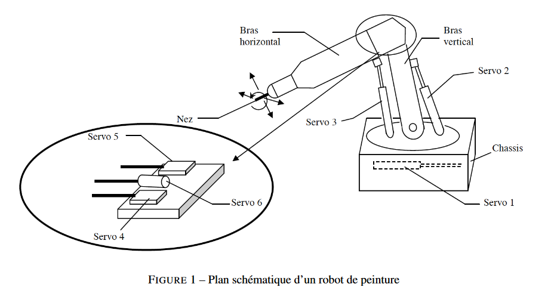

# Projet : Maintenance d’un robot de peinture

Dans ce projet on étudie la maintenance d'un robot permettant de positionner un
pistolet de peinture.



## Présentation du robot

Le robot à pour mission de positionner dans l'espace un pistolet à
peinture. Le pistolet est actionné par un autre système qui n'est pas
étudié ici.

Le robot doit donc positionner avec précision et au bon moment le
pistolet pour permettre ensuite au pistolet d'appliquer la peinture.

Le robot est composé des éléments suivants :

- (A) l'électrovanne du pistolet ;
- (B) Vérins ;
- (D) Poignets de programmation ;
- (E) Nez robot ;
- (F) Fin de course support bras ;
- (I) Carte DH ;
- (J) Carte Servo.

## Objectif de l'analyse

L'objectif est de proposer pour l'entreprise un nouveau plan de maintenance visant à minimiser
les coûts associés à la maintenance de ce robot.

Nous disposons pour cela de deux sources de données :

- un historique de durée inter-panne en heures de fonctionnement
pour chaque composant du robot ;
- Un retour d'expérience détaillant certaines pannes pour les différents composants du robot. Ce retour d'expérience prend la
forme d'un tableau excel dans lequel on retrouve, pour chaque panne
renseignée.

Dans un premier temps, on cherchera à classer les différents types de pannes selon la méthode ABC pour identifier quelles pannes sont prépondérantes dans les coûts totaux liés à la maintenance.

On essaiera ensuite de déterminer les paramètres des lois de durée de vie des composants en supposant qu'il s'agit de loi de Weibull. On estimera aussi le paramètre de la loi exponentielle associée au changement correctif visant à remplacer les éléments.

Enfin nous pourrons optimiser les politiques de maintenance pour les pannes de la classe A et B identifiées en début d'analyse.

## Classification des pannes par la méthode ABC.

Le principe de Pareto stipule qu'environ 80 % des effets sont le produit de 20 % des causes ([Principe de Pareto, Wikipédia](https://fr.wikipedia.org/wiki/Principe_de_Pareto)). Ce principe général à été observé par l'italien Vilfredo Pareto et on peut l'appliquer 
à différents phénomène observables.

Ce principe ne doit pas être appliqué à la lettre mais est une première approche souvent pertinente pour identifier les éléments prépondérant dans un phénomène et prioriser les actions.

La méthode ABC s'appuie sur ce principe de Pareto, en répartissant les éléments observés en trois classes : A, B et C, selon leurs effets pour le phénomène observé.

Appliqué au problématique de maintenance, on peut donc imaginer que 80% des coûts de maintenances sont issus de 20% des pannes, que l'on classera alors dans la catégorie A. Les 15% des coûts suivants sont le fruit de 30% des défaillances : la classe B. Enfin, la majorité des défaillance, soit les 50%
restants, ne jouent que sur 5% des coût totaux de maintenance. Ils constituent alors la classe C.

Pour chaque panne identifiées par le retour d'expérience, on va calculer le coût associé.

On pourra alors calculer un coût total de maintenance et observer quelles pannes contribuent le plus à ce coût total. Ces pannes seront alors prioritaires dans nos améliorations de politiques de maintenance.

### Calcul du coût d'une panne.

L'analyse des coût a permis d'identifier deux coûts associés à une panne :

- le coût de remplacement (coût de changement) d'une pièce estimé à $30€$ ;
- le coût d'inactivité estimé à $20€/min$.

On constate immédiatement que le coût immobilisation est prépondérant dans.
le coût total de la politique de maintenance : deux minutes d'arrêts sont plus coûteuses qu'un changement de pièce.

Le coût de remplacement étant fixe et identique pour chaque composant du robot, on peut se concentrer sur le coût d'immobilisation dans notre classification.

On va donc construire un diagramme ABC basée sur le temps d'arrêt des pannes associé à chaque élément pour identifier les éléments dont les pannes immobilisent le plus le robot.

### Construction du graphique ABC

```{r}
# pour faciliter la compilation
rm(list=ls())
# chargement des librairies utiles que j'aime utiliser dans mes projets
# je détaille les fonctions utilisées si nécessaires
library(readxl)
library(magrittr)
library(ggplot2)
library(stringr)
library(scales)
library(dplyr)

# thème personnel pour mes graphiques
custom_theme <- theme(
        panel.background = element_rect(fill = "#D9E8F1",
                                        colour = "#6D9EC1",
                                        size = 1, linetype = "solid")
)
```


```{r}
# récupération des données depuis le document excel
df <- readxl::read_xlsx("data/Historique panne.xlsx")
# le symbole '%>%' est nommé 'pipe' et signifie : passer en argument
# ici je passe le dataframe df en argument à la fonction `head()` pour
# afficher les premières colonnes.
df %>% head()
```

Le retour d'expérience est composé des données suivantes :

- `Date` : la date d'observation de la défaillance ;
- `temps d'arrêt` : temps d'arrêt observé pour cette défaillance ;
- `Nature du travail/défaut` décrit la défaillance et les opérations associées ;
- `Désignation` : le nom du composant défaillant ;
- `Repère` : le repère du composant défaillant.

Dans notre cas, ce sont les attributs : `temps d'arrêt` et `Repère` qui nous intéressent le plus.

```{r}
# Récupère dans `df_abc` que les colonnes utiles pour cette partie du projet
df_abc <- df %>% select("temps d'arrêt","Repère")
df_abc
```

Le temps d'arrêt étant stocké en tant que numérique, il faut les convertir
en valeur numérique.

```{r}
# convertit la colonne `temps d'arrêt` (char) en une colonne `temps_arret_min`
# en numérique (double)
df_abc <- df_abc %>% mutate(
    temps_arret_min = as.numeric(
        str_sub(`temps d'arrêt`,start = 1, end = -5)
    )
)
df_abc
```

Deux mesures ne possèdent pas de repère : cela signifie que la défaillance, selon les opérateurs chargés de répertorier les défaillances, ne concernent pas une partie spécifique du robot.

Dans un premier temps je propose d'ignorer ces défaillances que je qualifierai de "non attribuées". On discutera par la suite de la manière de les intégrer à l'analyse.

```{r}
# Retire les lignes contenant des NA
df_abc_noNA <- df_abc[!is.na(df_abc$Repère),]
df_abc_noNA
```

```{r}
temps_arret_total <- sum(df_abc_noNA$temps_arret_min)
temps_arret_total
```

```{r}
# Effectue le calcul du temps total d'arrêt par repère puis
# classe par ordre décroissant
somme_temps_arret_par_repere <- aggregate(temps_arret_min~Repère,
                                          data = df_abc_noNA, sum) %>%
    arrange(desc(temps_arret_min))

somme_temps_arret_par_repere
```

```{r}
# Ajoute un point fictif en (0,0) pour le graphique suivant
x_set <- c("", somme_temps_arret_par_repere$Repère); x_set
y_set <- c(0, cumsum(somme_temps_arret_par_repere$temps_arret_min)); y_set
```

À noter que les défaillances avec pour repère H et G sont des défaillances
ne se rapportant pas directement au robot :
- H : Disquette
- G : Manque de pression

```{r}
# ggplot permet de créer de plus jolis graphiques et est facilement
# utilisable pour un résultat proche de ce que l'on souhaite avoir
ggplot(mapping = aes(x = 0:9, y = y_set))+
    geom_line() +
    scale_x_continuous(breaks = 0:9,
                     labels = x_set) + 
    labs(x = "Repère de défaillance",
         y = "Temps cumulé en min",
         title = "Temps cumulé en min des différents repère de défaillance
         classés par ordre décroisant issu du REX") +
    custom_theme
```

Avec ce graphique, on peut facilement voir par exemple que le temps d'arrêt
cumulé des défaillances sur les repères E et D avoisine les 1500 minutes.

Comme on connait le coût d'arrêt par minute qui est de $ci=20€/min$, on peut facilement
produire le même graphique mais cette fois en € :

```{r}
# cout d'arret par minute en euro
ci = 20
ggplot(mapping = aes(x = 0:9, y = y_set * ci))+
    geom_line() +
    scale_x_continuous(breaks = 0:9,
                     labels = x_set) + 
    labs(x = "Repère de défaillance",
         y = "Coûts cumulés en €",
         title = "Coûts cumulés en euros des arrêts dus
         aux défaillances des différents repère,
         classés par ordre décroisant, issu du REX") +
    custom_theme
```

Pour simplifier la lecture, et distinguer nos classes A, B et C, je propose de
retourner sur l'analyse des temps d'arrêt (équivalent au coût par un simple
produit) et de raisonner en % du temps total d'arrêt mesuré.

On va séparer les repères dans les classes suivantes par ordre de contribution au temps d'arrêt total :

 - Classe A : Repères E et D soit "Nez robot" et "Poignées de programmation"
 - Classe B : "Electrovanne pistolet" et "Fin de course du support bras"
 - Classe C : le reste.
 
```{r}
ggplot(mapping = aes(x = 0:9, y = 100*y_set/temps_arret_total))+
    geom_line() +
    ylim(c(0,100)) +
    scale_x_continuous(breaks = 0:9,
                     labels = x_set) + 
    labs(x = "Repère de défaillance",
         y = "% coût cumulé en €",
         title = "% du coût d'immobilisation cumulé en € des différents repère de défaillance
         classés par ordre croisant") +
    geom_hline(yintercept = 100*y_set[3]/temps_arret_total,
               color = 'red') +
    annotate(geom = "text",
             x = 0,
             y = 100*y_set[3]/temps_arret_total+5,
             label = paste(
                 round(100*y_set[3]/temps_arret_total),"%"),
             color = 'red') +
    geom_area(aes(x = 0:2, y = 100*y_set[3]/temps_arret_total),
              fill = 'red',
              alpha = 0.4,
              color = 'red') +
    geom_hline(yintercept = 100*y_set[5]/temps_arret_total,
               color = 'orange') +
    annotate(geom = "text",
             x = 1,
             y = 100*y_set[5]/temps_arret_total+5,
             label = paste(
                 round(100*y_set[5]/temps_arret_total),"%"),
             color = 'orange') +
    geom_area(aes(x = 2:4, y = 100*y_set[5]/temps_arret_total),
              fill = 'orange',
              alpha = 0.4,
              color = 'orange') +
    geom_area(aes(x = 4:9, y = 100),
              fill = 'green',
              alpha = 0.4,
              color = 'green') +
    annotate(geom = "text", x = 1, y = 25, label = "A = E & D", color = 'red',
             size = 10) +
    annotate(geom = "text", x = 3, y = 50, label = "B = A & F", color = 'orange',
             size = 10) +
    annotate(geom = "text", x = 6.5, y = 60, label = "C = I, ", color = 'green',
             size = 10) +
    custom_theme
```
 
Sur le graphique on peut alors observer que les défaillances liées aux repères E et D (la classe A),
soit le "Nez robot" et la "Poignées de programmation" représentent à elles
seules 74% du coût d'immobilisation (puisque ces défaillances représentent
74% du temps d'immobilisation total).

La classe B représente 18% du coût total d'immobilisation.

Les autres défaillances (classe C) représentent donc 8% du temps total
d'immobilisation.

La priorité devra donc être mise sur la politique de maintenance des composants des classes A et B (les repères E, D, A, F).

## Estimation des durées de vie de chaque élément.

On cherche à présent à définir la durée de vie de chaque élément du robot. Cette
information sera utile pour ensuite pour créer un modèle permettant l'optimisation
de la politique de maintenance.

### Modèle mathématique

On suppose que la durée de bon fonctionnement avant la panne de chaque composant
$\omega$, avec $\omega \in [A,B,D,E,F,G,H,I,J]$ est une variable aléatoire
notée $T_{\omega}$ à valeur dans $\mathbb{R}_+^*$.

On suppose que les $T_{\omega}$ suivent une loi de Weibull de paramètre d'échelle
$\alpha$ et de forme $\beta$.
On note alors $T_{\omega} \sim \mathbf{W}(\alpha_{\omega},\beta_{\omega})$.

On cherche alors a estimer les paramètres $(\alpha_{\omega},\beta_{\omega})$,
pour avoir une idée plus précise du comportement des composants.

### Méthode d'estimation par maximum de vraissemblance

Wikipédia définit [la vraisemblance](https://fr.wikipedia.org/wiki/Fonction_de_vraisemblance) comme :
"fonction des paramètres d'un modèle statistique calculée à partir de données observées".

Sous l'hypothèse d'un modèle connu, la fonction de vraisemblance (notée
$\mathll{L}$permet de 
calculer la probabilité d'obtenir une un tirage précis d'observation. C'est
en somme la probabilité d'obtenir ce résultat précis de tirage en supposant un
modèle précis.

On note la vraisemblance $L(\vec{\theta},\vec{x})$, avec $\vec{\theta}$ les paramètre de notre modèle et $\vec{\mathbb{x}}$ le vecteur des observations
issues de $n$ variables aléatoires $X_i$

On a lors :
$L(\vec{\theta},\vec{x})=\prod_{i=1}^{n}f_i(\vec{\theta},x_i)$.

L'estimation par maximum de vraisemblance, revient à chercher, pour un jeu
d'observation donné $\vec{x}$, les paramètres $\vec{\theta}^*$ qui maximisent
la fonction de vraisemblance.

Cela revient à chercher : avec les observations obtenues, quels sont les valeurs
prises par mon modèle les plus "vraisemblables".

La maximisation passe par l'annulation dérivée (ou les dérivées partielles) suivant les paramètres.

### Application au cas de la loi de Weibull

On se place dans un cas de maintenance parfaite (chaque maintenance remet à neuf
le système en remplaçant les composants) suivant une loi de Weibull.

Pour rappel la loi de Weibull possède la densité suivante :
$$
f_i(\alpha,\beta,x_i) = \left( \frac{\beta}{\alpha} \right)
\left( \frac{x_i}{\alpha} \right)^{\beta-1}
e^{-\left( \frac{x_i}{\alpha}\right)^{\beta}}
$$

Le calcul de la vraisemblance est donc relativement complexe. Si l'on souhaite une
solution analytique au problème, il est préférable de passer la log-vraissemblance.

En effet, la fonction logarithme étant croissante, maximiser la log-vraissemblance
revient à maximiser la vraisemblance.

Après un développement, on obtient alors le système :

$$
\alpha^*= \left( \frac{1}{n}\sum_{i=1}^{n}x_i^{\beta^*}\right)^{\frac{1}{\beta^*}} \\
\frac{1}{\beta^*}\frac{\sum_{i=1}^{n}ln(x_i)}{n}-
\frac{\sum_{i=1}^{n}x_i^{\beta^*}ln(x_i)}{\sum_{i=1}^{n}x_i^{\beta^*}}=0
$$
que l'on doit résoudre pour obtenir $\beta^*$ et $\alpha^*$ qui sont alors les
estimateurs du maximum de vraisemblance que l'on notera $\hat{\alpha}_{MV}$ et
$\hat{\beta}_{MV}$.

Plusieurs solutions existent pour obtenir ses estimateurs sans passer par la résolution
de ce système.

### Construction des données

Pour estimer les paramètres des lois, on utilise les données d'analyse de durées
de défaillance entre deux pannes (en heures).

```{r}
durees_inter_panne <- list(
    A = c(100,150,30,45,170,195,200,250,340,60),
    B = c(250,400,430,670,1000,1500,1200,1050,480),
    D = c(55,40,70,120,150,270,200,190),
    E = c(110,208,170,190,155,230,340,150,160,195,280,250),
    F = c(45,60,72,68,95,12,18,40,49),
    I = c(111,70,50,60,80,904,100,75,67,71,110),
    J = c(130,150,117,200,180,155,140,130,81,75)
)
```

### Estimations

#### Utilisation de `nlm`

La fonction `nlm` permet de minimiser une fonction dans R suivant un jeu de
paramètre.

On peut alors utiliser cette fonction pour minimiser la fonction -log-vraisemblance,
ce qui revient à maximiser la vraisemblance.

La log-vraisemblance dans le cas d'un loi de Weibull s'écrit :

$$
lnL(\alpha,\beta,\vec{x}) = nln(\beta)-n\beta ln(\alpha)+(\beta-1)\sum_{i=1}^{n}ln(x_i)
-\frac{1}{\alpha^{\beta}}\sum_{i=1}^{n}(x_i)^{\beta}
$$

Donc on va minimiser la fonction :

$$
-lnL(\alpha,\beta,\vec{x}) = -nln(\beta)+n\beta ln(\alpha)-(\beta-1)\sum_{i=1}^{n}ln(x_i)
+\frac{1}{\alpha^{\beta}}\sum_{i=1}^{n}(x_i)^{\beta}
$$

```{r}
neg_log_likelihood <- function(param, xi) {
    
    # la fonction nlm ne prenant qu'un seul paramètre : les paramètres d'optimisation,
    # il faut donc utiliser un tableau 'param' dans lequel :
    # param[1] = alpha
    # param[2] = beta
    
    n <- length(xi)
    
    -n * log(param[2]) +
        n * param[2] * log(param[1]) -
        (param[2]-1) * sum(log(xi)) +
        (1/(param[1]^(param[2]))) * sum((xi)^param[2]) %>%
        return()
        
}
```

```{r message=FALSE, warning=FALSE}
estim_max_likelihood <- c()
for (xi in durees_inter_panne) {
    ans <- nlm(f = neg_log_likelihood, p = c(1,1), xi)
    # print(ans$estimate)
    estim_max_likelihood <- c(estim_max_likelihood, ans$estimate)
}

estim_max_likelihood <- tibble::as_data_frame(
    matrix(estim_max_likelihood, ncol = 2, byrow = TRUE)
)
estim_max_likelihood$Repère <- c("A", "B", "D", "E", "F", "I", "J")
colnames(estim_max_likelihood) <- c("Alpha", "Beta", "Repère")
estim_max_likelihood
```

La fonction `neg_log_likelihood` calcul la -log-vraisemblance tel que décrite dans
l'équation plus haut. Cependant il tout à fait possible d'optimiser avec la fonction
`nlm` en partant d'une écrite plus simple de la fonction :

$$
-lnL(\alpha,\beta,\vec{x}) = \sum_{i=1}^{n}ln(f_i(\alpha,\beta,x_i))
$$

```{r warning=FALSE}
LL_Wei <- function(param, xi) {
    vec <- dweibull(xi, scale = param[1], shape = param[2])
    -sum(log(vec)) %>% return()
}
for (xi in durees_inter_panne) {
    print(nlm(LL_Wei,c(mean(xi),1),xi)$estimate)
}
```

On a donc pour chaque composant du robot, l'estimations des paramètres de la
durée de vie suivant une loi de Weibull.

#### Fonction `eweibull`

Cette fonction du package `EnvStats` effectue l'estimation des paramètre d'une
loi de Weibull suivant la méthode du maximum de vraisemblance directement à partir
des données

```{r message=FALSE}
library(EnvStats)
ewebull_estim <- c()
for (xi in durees_inter_panne) {
    ewebull_estim <- c(ewebull_estim, eweibull(xi, method = "mle")$parameters)
}
ewebull_estim <- tibble::as_data_frame(
    matrix(ewebull_estim, ncol = 2, byrow = TRUE)
)
ewebull_estim$Repère <- c("A", "B", "D", "E", "F", "I", "J")
colnames(ewebull_estim) <- c("Beta", "Alpha", "Repère")
ewebull_estim
```

```{r}
ewebull_estim
estim_max_likelihood
```


Malgré de très légères différences, les deux solutions permettent d’obtenir les
mêmes estimateurs.

Je décide de conserver les résultat obtenus à l'aide de la fonction 

On peut ensuite tracer les densités associées et donner le $MTTF$ pour mieux
se repréenter les comportement des composants.

```{r}
composants <- c("Electrovanne pistolet",
                "Vérins ",
                "Bras horizontal - Poignets de programmation",
                "Nez robot",
                "Fin de course support bras",
                "Carte DH",
                "Carte Servo")
reperes <- y_set

t_div <- seq(0,1000,1)

ggplot() +
    geom_line(aes(x = t_div,
                  y = dweibull(t_div,
                               scale = ewebull_estim$Alpha[1],
                               shape = ewebull_estim$Beta[1]),
              colour = "A")) +
    geom_line(aes(x = t_div,
                  y = dweibull(t_div,
                               scale = ewebull_estim$Alpha[2],
                               shape = ewebull_estim$Beta[2]),
                  colour = "B")) +
    geom_line(aes(x = t_div,
                  y = dweibull(t_div,
                               scale = ewebull_estim$Alpha[3],
                               shape = ewebull_estim$Beta[3]),
              colour = "D")) +
    geom_line(aes(x = t_div,
                  y = dweibull(t_div,
                               scale = ewebull_estim$Alpha[4],
                               shape = ewebull_estim$Beta[4]),
              colour = "E")) +
    geom_line(aes(x = t_div,
                  y = dweibull(t_div,
                               scale = ewebull_estim$Alpha[5],
                               shape = ewebull_estim$Beta[5]),
              colour = "F")) +
    geom_line(aes(x = t_div,
                  y = dweibull(t_div,
                               scale = ewebull_estim$Alpha[6],
                               shape = ewebull_estim$Beta[6]),
                    colour = "I")) +
    geom_line(aes(x = t_div,
                  y = dweibull(t_div,
                               scale = ewebull_estim$Alpha[7],
                               shape = ewebull_estim$Beta[7]),
                  colour = "J")) +
    scale_color_manual(name = "Repères",
                       values = c("A" = 'red',
                                  "B" = "#FF9600",
                                  "D" = 'yellow',
                                  "E" = 'green',
                                  "F" = 'magenta',
                                  "I" = 'black',
                                  "J" = 'brown')) +
    labs(title = "Représentation des densités des lois de durées de vie
         pour les différents composant du robot",
         x = "t",
         y = "f(t)") +
    custom_theme
```


On peut ensuite calculer le $MTTF$. Pour une loi de Weibull, on a
$E[X_i]=\alpha \Gamma (1+\frac{1}{\beta})$

```{r}
estim_max_likelihood$MTTF <- as.double(1:7)

for (i in 1:7) {
    estim_max_likelihood[i,'MTTF'] <- ewebull_estim$Alpha[i] *
        gamma(1+1/ewebull_estim$Beta[i])
}
estim_max_likelihood
```

Toutes les valeurs manipulées sont en heures de fonctionnement.

## Estimation des distributions des durées de changement correctif pour chaque élément.

Après avoir estimé les les paramètres des lois de Weibull des durées inter-panne
(loi de durée de vie) des composants du robot, on va maintenant chercher
à estimer les temps de remplacement pour chacun des ces derniers.

On va exploiter, pour cela, les données issues du fichier de retour d'expérience.

On peut réutiliser la même démarche que précédemment, en cherchant les estimateurs
du maximum de vraisemblance. Cette fois, on suppose que les durées suivent des
lois exponentielles. 

Cette loi étant plus simple que la loi de Weibull, il est possible d'obtenir
l'estimateur du maximum de vraisemblance analytiquement.

$$
\hat{\lambda}_{MV} = \frac{n}{\sum_{i=1}^{n}(x_i)}=\frac{1}{\hat{m}}
$$

Soit l'inverse de la moyenne empirique de l'échantillon mesurée $\hat{m}$.

```{r}
estim_mv_expo <- function(xi) {
    1/mean(xi) %>% return()
}
# Effectue le calcul de l'inverse de la moyenne par repère
estim_param_duree_remplacement <- aggregate(temps_arret_min~Repère,
                                          data = df_abc_noNA, estim_mv_expo)
estim_param_duree_remplacement
```

On peut ensuite calculer le temps moyen de remplacement :

```{r}
estim_param_duree_remplacement$TempsMoyen <- 1/estim_param_duree_remplacement$temps_arret_min
estim_param_duree_remplacement
```

